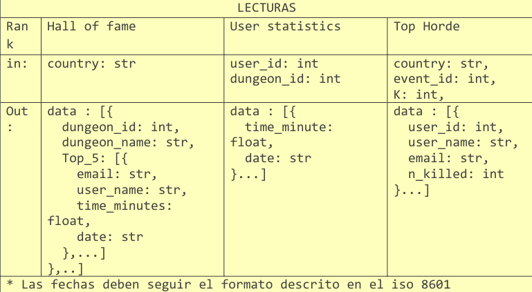
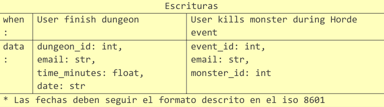

# Trabajo base de datos II: Cassandra ☺️
### Pedro Ortiz y Santiago Diaz

## Objetivo de la Practica

Se desea realizar un prototipo de una base de datos de Cassandra para dar servicio a los
tres leaderboards anteriores. El juego hace tres peticiones de lectura al servidor que se
resumen en la siguiente tabla. La fila “rank” indica el leaderbord que se puebla con la
petición de lectura, la fila "in” indica los parámetros de entrada que recibe la llamada y
“out” indica el formato de los datos que devuelve el servidor. Nótese que los leaderboards
son locales a cada país:



Además, el juego hace dos peticiones de escritura al servidor que se ejecutan cuando
ocurre un evento concreto durante el juego. La siguiente tabla muestra la información de
las peticiones de escritura, la fila “When” indica el evento en el juego que dispara la
petición de escritura y la fila “data” indica los datos que se envían al servidor: 



__Tareas__
1. Diseña una base de datos Cassandra para dar servicio a las lecturas y escrituras
anteriores. Argumenta tus decisiones de diseño.

2. Crea las consultas .sql necesarias para exportar los datos de la base de datos
relacional a ficheros .csv. Los ficheros deberán tener un formato acorde al diseño
del punto 1.

3. Prepara un cluster local de 3 nodos todos en el mismo rack y datacenter.

4. Haz un fichero .cql que creen tu diseño en Cassandra y cargue los ficheros .csv
creados en el paso 2. Se debe utilizar un factor de replicación de 2 y tener en
cuenta que se las pruebas se ejecutaran en un cluster local.

5. [OPCIONAL] Si el diseño lo necesita, actualiza la tabla de escrituras para incluir
cualquier modificación que sea necesaria en la información que se le debe
proporcionar al servidor.

6. Haz un fichero .cql que realice las consultas de escritura y lectura necesarias.
Incluye el nivel de consistencia de cada consulta, teniendo en cuenta las
características de los diferentes rankings.

## Solucion propuesta

### Paso 1: Crear Base de Datos Mysql

Creamos el docker compose de Mysql e importamos los datos desde la propia terminal que nos ofrece docker.

```
docker exec -it Mysql mysql

USE Dungeos;

SOURCE /data/dumpVideogameMaster.sql;
```

### Paso 2: Exportar CSV's

__Primera consulta__

Esta consulta SQL se utiliza para migrar los datos de una base de datos de SQL. El objetivo es obtener información sobre los 5 mejores jugadores de cada mazmorra por país, incluyendo el nombre de la mazmorra, el nombre de usuario del jugador, el tiempo que tardaron en superarla y la fecha en que lo hicieron. Estos resultados se guardarán en un archivo CSV.

```SQL
SELECT t.email, t.country, t.idD, t.lowest_time, t.date, t.name, t.userName
FROM (
    SELECT
        w.email,
        w.country,
        d.idD,
        MIN(cd.time) AS lowest_time,
        w.date,
        d.name,
        w.userName,
        ROW_NUMBER() OVER 
			(PARTITION BY w.country, d.idD 
			ORDER BY MIN(cd.time), w.email) 
			AS indx
    FROM WebUser w
    JOIN CompletedDungeons cd ON cd.email = w.email
    JOIN Dungeon d ON cd.idD = d.idD
    GROUP BY w.email, d.idD, w.country, w.date, d.name, w.userName
) AS t
WHERE t.indx <= 5
ORDER BY t.country, t.idD, t.lowest_time, t.email
INTO OUTFILE '/var/lib/mysql-files/hall_of_fame.csv'
FIELDS TERMINATED BY ',' ENCLOSED BY '"'
LINES TERMINATED BY '\n';
```

__Segunda consulta__

Esta consulta SQL se utiliza para obtener una lista de los tiempos que un jugador ha tomado para completar una mazmorra en particular. Los tiempos se organizan en orden ascendente, desde los más bajos hasta los más altos. Los datos incluyen el correo electrónico del jugador (email), el identificador de la mazmorra (idD), el tiempo que tardó en completarla (time), y la fecha en que se completó (date).

```SQL
SELECT cd.email, cd.idD, cd.time, cd.date
FROM CompletedDungeons cd
ORDER BY
    cd.email,
    cd.idD,
    cd.time ASC
INTO OUTFILE '/var/lib/mysql-files/user_statistics.csv'
FIELDS TERMINATED BY ',' ENCLOSED BY '"'
LINES TERMINATED BY '\n';
```

__Tercera consulta__

Esta consulta SQL se utiliza para crear una clasificación de las hordas en función del número de asesinatos (o "kills") que han realizado los jugadores. Los resultados incluyen el país del jugador (country), el identificador de la horda (idE), el nombre de usuario del jugador (userName), su correo electrónico (email), y la cantidad total de kills que ha realizado (n_kills).

```SQL
SELECT W.country, K.idE, W.userName, W.email, COUNT(*) AS n_kills
FROM Kills K
JOIN WebUser W ON K.email = W.email
GROUP BY K.idE, W.country, W.userName, W.email
ORDER BY
    W.country ASC,
    K.idE ASC,
    n_kills DESC,
    W.userName ASC
INTO OUTFILE '/var/lib/mysql-files/top_horde.csv'
FIELDS TERMINATED BY ',' ENCLOSED BY '"'
LINES TERMINATED BY '\n';
```

### Paso 3: Crear Base de Datos Cassandra

Vamos a crear la base de datos segun se especifica: tres nodos en el mismo rack (RC1) y datacenter (DC1)

```
- CASSANDRA_CLUSTER_NAME=MyCluster
- CASSANDRA_SEEDS=cassandra1,cassandra2,cassandra3
- CASSANDRA_DC=DC1
- CASSANDRA_RACK=Rack1
- CASSANDRA_ENDPOINT_SNITCH=GossipingPropertyFileSnitch
- MAX_HEAP_SIZE=256M
```

copiamos los ficheros corrspondientes al nodo 1, para cargar el nuevo esquema con el contenio de los CSV's.

```
docker cp ./load_create_database.cql cassandra1:/cassandra.cql
docker cp ./queries_cassandra.cql cassandra1:/test_queries.cql
```

y procedemos a crear y cargar los datos:

```
docker exec -it cassandra1 cqlsh
cqlsh> SOURCE '/cassandra.cql'
cqlsh> USE dungeons;
cqlsh> SOURCE '/test_queries.cql'
```

Veamos el esquema que hemos creado:

creamos el keyspace con un factor de replicacion 2, como se especifica.
Usamos el CONSISTENCY ALL; ya que es útil en situaciones donde se requiere una garantía absoluta de que los datos están disponibles y actualizados en todas las réplicas, a pesar de los posibles costos de latencia y rendimiento adicionales que pueda tener esta alta consistencia.

```SQL
CREATE KEYSPACE IF NOT EXISTS Dungeons WITH replication = {'class': 'SimpleStrategy', 'replication_factor': 2};

USE dungeons;

-- CONSISTENCY ALL; -- Puede ser mas lento pero la consistencia es maxima
```

Las tablas para lectura son las siguientes:

__tabla hall of fame__

En esta tabla, la clave primaria compuesta (country, dungeon_id, time_minutes, email) se ha elegido para permitir consultas eficientes basadas en país, mazmorra y tiempo de completado más bajo por jugador. Al utilizar country y dungeon_id como parte de la clave primaria, se distribuyen los datos de manera equitativa en los nodos de Cassandra, facilitando consultas rápidas por país y mazmorra. La inclusión de time_minutes en la clave primaria permite ordenar los resultados por tiempo más bajo de manera eficiente. Al mismo tiempo, al incluir email en la clave primaria, se garantiza que cada jugador tenga una única entrada por país, mazmorra y tiempo más bajo, evitando duplicados y facilitando las consultas específicas del jugador.

```SQL
CREATE TABLE IF NOT EXISTS hall_of_fame (
    country TEXT,
    dungeon_id INT,
    dungeon_name VARCHAR,
    email TEXT,
    username VARCHAR,
    time_minutes INT,
    date TIMESTAMP,
    PRIMARY KEY (country, dungeon_id, time_minutes, email, date)
);
```

__tabla user statistics__

En esta tabla, la clave primaria compuesta (email, dungeon_id, time_minute, date) se ha diseñado para proporcionar un acceso rápido a las estadísticas específicas de un jugador, como sus tiempos más bajos en diferentes mazmorras. La elección de email como parte de la partición asegura que todos los datos de un jugador específico estén almacenados juntos en el mismo nodo, lo que mejora el rendimiento al acceder a los datos de un jugador. La inclusión de dungeon_id y time_minutes en la clave primaria permite consultas eficientes para obtener los tiempos más bajos de un jugador en diferentes mazmorras. date garantiza la unicidad de los datos insertados. Ademas, usando clustering garantizamos que las consultas por dungeon_id y time_minutes sean mas eficientes.

```SQL
CREATE TABLE IF NOT EXISTS user_statistics (
    dungeon_id INT,
    email TEXT,
    time_minute INT,
    date TIMESTAMP,
    PRIMARY KEY (email, dungeon_id, time_minute, date)
) WITH CLUSTERING ORDER BY (dungeon_id ASC, time_minute ASC);
```

__tabla top horde__

En esta tabla, la clave primaria compuesta (country, event_id, n_kills, email) con ordenamiento descendente por n_kills y ascendente por email se ha diseñado para facilitar la obtención de los mejores jugadores por cantidad de asesinatos en una horda específica. La elección de country y event_id como parte de la partición permite una distribución equilibrada de datos y consultas eficientes por país y evento de horda. n_kills al ser de tipo COUNTER se podra acumular sumas (+1) se manera efecienta cada vez que un user mate a un moster.

```SQL
CREATE TABLE IF NOT EXISTS top_horde (
    country TEXT,
    event_id INT,
    username VARCHAR,
    email TEXT,
    n_kills COUNTER,
    PRIMARY KEY (country, event_id, email, username)
);
```

Cargamos los datos:

```SQL
COPY hall_of_fame (email, country, dungeon_id, time_minutes, date, dungeon_name, username) 
FROM '/csv_folder/hall_of_fame.csv' WITH HEADER = false;

COPY user_statistics (email, dungeon_id, time_minute, date) 
FROM '/csv_folder/user_statictics.csv' WITH HEADER = false;

COPY top_horde (country, event_id, email, n_kills) 
FROM '/csv_folder/top_horde.csv' WITH HEADER = false;
```

### Paso 4: Consultas de lectura y escritura de prueba

```SQL
-- HALL OF FAME
-- LECTURA
CONSISTENCY QUORUM;
SELECT * FROM hall_of_fame 
WHERE country = 'es_ES'
LIMIT 5;

-- ESCRITURA
-- es algo inneficiente pero sirve ya que en hall_of_fame no es necesario tener unas politicas de consistencia perfecta.
-- primero, extraer el top 5 del hall of fame de un pais y en la dungeon del usuario que acababa de hacer.
-- EJEMPLO:

SELECT * FROM hall_of_fame 
    WHERE country = 'es_ES' 
    AND dungeon_id = 0
ORDER BY time_minutes DESC
LIMIT 5;


-- segundo, ver si el time del usuario es mas bajo que los que ya estan.
            -- si no, break
            -- si si, continuamos

-- tercero, insertamos el nuevo valor

-- cuatro, si queremos conservar el top 5 por cada dungeon, deberemos hacer periodicamnete la querie primera para ir haciendo
-- un delete de los usuarios cuyos tiempos sean menores que el top 5.

-- USER STATISTICS
-- LECTURA
CONSISTENCY ONE;
SELECT * FROM user_statistics WHERE email = 'abellahector@example.org' AND dungeon_id = 1;

-- ESCRITURA
CONSISTENCY QUORUM;
INSERT INTO user_statistics (dungeon_id, email, time_minute, date)
VALUES (1, 'usuario1@example.com', 30, '2024-04-15 12:00:00');


-- TOP HORDE
-- LECTURA
CONSISTENCY LOCAL_ONE;
SELECT * FROM top_horde 
WHERE country = 'es_ES' 
    AND event_id = 1 
LIMIT 5;


-- ESCRITURA
-- EJEMPLO
CONSISTENCY QUORUM;
UPDATE top_horde 
SET n_kills = n_kills + 1 
where country = 'es_ES' 
    AND event_id = 1 
    AND email = 'abellahector@example.org' 
    AND username = 'paula29';
```

Todo el contenido de prubas de puede ver en el fichero:

```
cassandra/queries_cassandra.cql
```

La logica detras de las condiciones para la actualizacion del hall of fame y otras, se puede implementar en python por parte del cliente con librerias como SQLAlchemy. Para parsear los json's hariamos lo mismo.

Tipos de Consistencias:

QUORUM garantiza que los datos leídos estén presentes en la mayoría de las réplicas (al menos en la mitad más uno de los nodos en el clúster). Esto asegura que obtengas los datos más actualizados y que se eviten inconsistencias debido a lecturas desactualizadas.

ONE es suficiente si estás bien con obtener una respuesta rápida y no es crítico obtener los datos más recientes en todo momento. Puedes sacrificar un poco la consistencia para obtener un mejor rendimiento en la lectura.

LOCAL_ONE es adecuado si deseas una lectura rápida con una consistencia ligeramente relajada. Esto significa que la lectura se realizará en el nodo local, lo que reduce la latencia y es apropiado para consultas que no necesitan una consistencia estricta.